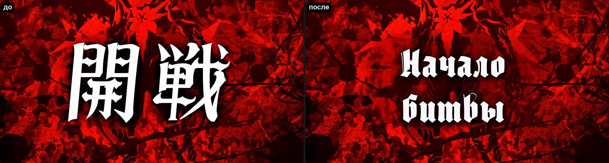
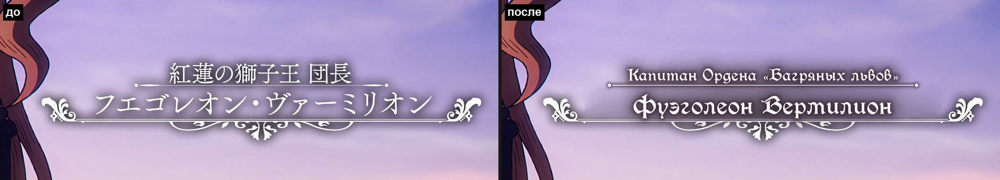
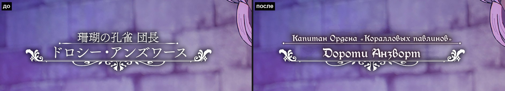
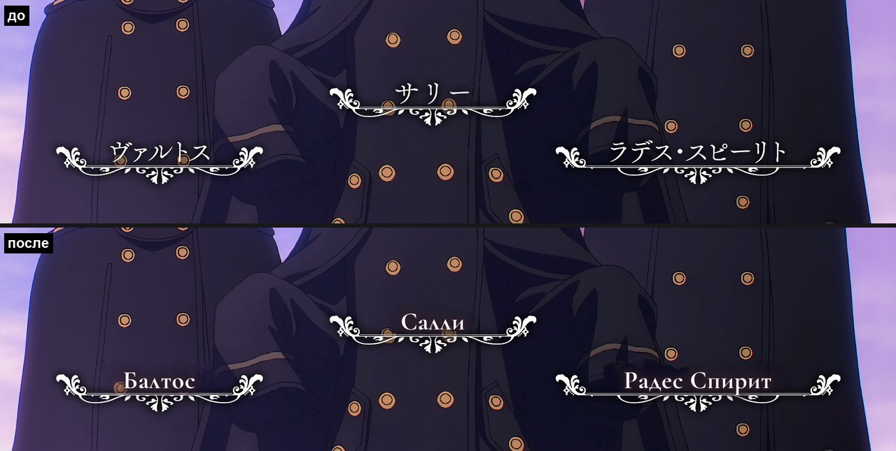

# anime-typeset

**A Claude Code skill for anime sign typesetting (ASS / libass).** Give it the episode video and a signs file
with timings (for example Crunchyroll signs from a release): it finds every sign in the video, erases the
Japanese text with a patch rebuilt from the video itself — no solid boxes, the background keeps moving with
the camera — and sets the translated text in the style of the original. Output: a signs `.ass`, a preview
video, and the signs merged into your dialogue subs. Instructions and presets are in Russian.

---

Навык для [Claude Code](https://claude.com/claude-code): тайпсет надписей к аниме. На входе — видео и файл
надписей с таймингами (обычно надписи Crunchyroll из релиза). На выходе — готовый `.ass`: японский текст
закрыт фоном, восстановленным из самого видео, а русский набран в стиле оригинала. Плюс превью-видео и
вставка надписей в файл сабов.

## Примеры

Black Clover, 2-й сезон, 1-я серия: «до» — кадр как есть, «после» — с готовыми надписями. Японский текст стёрт
вместе с ореолом и тенью, фон под ним восстановлен из самого видео, русский набран в стиле оригинала.

**Название серии.** 開戦 стоит на анимированном красном фоне, который всё время медленно наезжает: чистый фон
взят из кадра до появления надписи и ведётся трекингом. «Начало битвы» — готическим шрифтом с такой же
тяжёлой тенью.



**Именные карточки.** Японские титул и имя стёрты, линия над именем перерисована под ширину русского титула,
завитки и орнамент — оригинальные.



У Дороти фон — кирпичная стена, которая едет за камерой: заплатка едет вместе с ней.



**Три карточки на проезде.** Камера за 5 секунд уходит вниз на 900 px, карточки стоят поверх пальто с
пуговицами — у каждой свой трек по фигуре над ней, пуговицы под надписями остаются на месте.



## Что умеет

- **Закрывает японский текст без плашек.** Заплатка — мозаика из прямоугольников цвета фона: фон берётся из
  медианы кадров, из кадров до появления текста или гладкой заливкой. На панорамах и наездах заплатка едет
  вместе с камерой (трекинг сдвига, аффинный ECC-трекинг, масштаб по шаблону).
- **Именные карточки с орнаментом**: сама находит геометрию (линии, завитки, подчёркивание), стирает
  японский титул и имя вместе с их ореолом, подгоняет модель свечения по самой карточке и набирает русский
  текст по тем же базовым линиям. Работает и на движущемся фоне.
- **Таблички, титры, название серии, лого опенинга** (текст едет за зумом логотипа и прячется за
  пролетающими силуэтами), текст на объектах сцены, который движется вместе с ними.
- **Оформление CR как подсказка.** Строки переводчика — это бесплатные замеры: где стоит оригинал, когда
  появляется. Можно оставить текст CR и только закрыть японский, а можно переоформить в стиле оригинала.
- **Шрифт под оригинал.** Claude называет кандидатов по жанру, скрипт меряет штрихи японского текста и
  ранжирует установленные шрифты и ~300 шрифтов Google с кириллицей: категория, вес в пикселях на экране,
  отсев «карандаша» и разреженной кириллицы японских шрифтов. Всё — на одном листе поверх кадра рядом с
  текущим шрифтом пресета; выбирается глазами или вопросом пользователю. Выбранные шрифты скачиваются сами
  и кладутся в папку релиза.
- **Безопасная вставка в сабы**: удаляются только строки надписей переводчика и прошлой вставки, диалог не
  трогается — до и после он сверяется построчно. Копии оригиналов кладутся в подпапку `исходники`.
- **Тайминг по оригиналу.** Надпись стоит ровно столько, сколько на экране японский текст: начало и конец
  берутся по самому кадру (включая проявление и затухание), а не по таймингу переводчика.
- **Компактный результат.** Целые координаты, клип каждой строки урезан до её участка, мозаика рисуется в
  «порядке художника», проезды разбиты на минимум отрезков. На 1-й серии Black Clover 2: 3.6 → 2.3 МБ
  при той же картинке (проверено рендером в 4K).
- **Учится от серии к серии**: решения записываются в `episode.json` — это рецепт серии; повторяющиеся
  элементы тайтла выносятся в пресет.

## Как это выглядит в работе

1. `analyze` — склейки вокруг таймингов, тайминг по самому кадру (когда японский текст на экране), движение
   камеры, поиск карточек, контактный лист на каждую надпись и черновик `episode.json`.
2. Claude смотрит листы, меряет (`ruler`, `grid`, `probe`, `track`) и записывает решения в `episode.json`.
3. `build` — заплатки и текст для каждой надписи (параллельно) и контрольные кадры через libass.
4. Проверка по чек-листу, правка параметров отдельных надписей, пересборка только их.
5. `assemble` → `.ass`, `preview` → mp4, `merge` → вставка в сабы.
6. Там же, без отдельной просьбы: отчёт о прогоне (`feedback/`), доработка инструмента по нему, регрессия на
   прошлых сериях из `examples/`, рецепт серии в `examples/`, уборка рабочей папки в Корзину.

## Требования

- [Claude Code](https://claude.com/claude-code).
- Python 3.10+ и пакеты `numpy opencv-python pillow fonttools`.
- ffmpeg с libass (фильтр `subtitles`) в `PATH`. NVIDIA GPU не обязателен: если есть, кадры декодируются
  через CUDA, а превью кодируется NVENC.
- Шрифты, которые указаны в пресете тайтла, установленные в системе. Для Black Clover это Cormorant
  Garamond (OFL), Palatino Linotype и Moyenage.

Проверка окружения: `python scripts/typeset.py doctor`.

Разрабатывалось и проверялось на Windows (Git Bash / PowerShell); сам инструмент — обычный Python + ffmpeg.

## Установка

Claude Code ищет навыки в `~/.claude/skills/`. Есть два варианта:

```bash
git clone https://github.com/sh1guchi/anime-typeset ~/.claude/skills/anime-typeset
```

Или склонировать в любое место и на Windows запустить `install.bat`: он зеркалит папку в
`%USERPROFILE%\.claude\skills\anime-typeset`. Так рабочая копия остаётся отдельно, и после правок её надо
снова ставить через `install.bat`.

## Как пользоваться

Положи видео и надписи в одну папку (например `надписи\` и `сабы\` рядом с видео) и напиши Claude:

```
/anime-typeset
Тайтл: <название>, серия <N>.
Видео: <путь к .mkv>
Надписи (Crunchyroll, уже оформлены): <путь к .ass надписей>
Сабы, куда влить надписи с заменой: <путь к .ass сабов>
Шрифты релиза (если есть): <папка или .zip>

Японский текст закрывай масками везде, где это возможно без видимых заплаток. Оформление CR оставляй,
если оно нормальное, иначе переоформи в стиле оригинала. Тайтл новый — по ходу создай для него пресет.
Нужны: .ass надписей, превью и вставка в сабы (диалог не трогать). Расхождения перевода с кадром не
исправляй — выпиши мне.
```

Навык срабатывает и без `/anime-typeset`, если в сообщении речь о надписях или тайпсете.

## Где что лежит

- `SKILL.md` — инструкция для Claude: порядок работы, выбор типа надписи, чек-лист проверки.
- `scripts/typeset.py` + `scripts/tslib/` — сам инструмент (команды: `doctor`, `analyze`, `build`, `check`,
  `assemble`, `preview`, `merge`, `compact`, `grid`, `ruler`, `geom`, `probe`, `track`, `fonts`, `set`,
  `split`, `add`, `timing`, `sheet`; `python scripts/typeset.py -h`).
- `presets/` — стили и параметры тайтлов: `black-clover`, `grand-blue`, `kimetsu-no-yaiba`, `to-be-hero-x`,
  `default`.
- `examples/` — рабочие конфиги готовых серий (рецепты), решения по надписям (`*.notes.md`) и черновики
  `analyze` (`*.draft.json`). Пути в них — относительно рабочей папки `<папка видео>/_typeset/<имя видео>/`.
- `references/` — формат `episode.json`, как устроены маски, цвет и сжатие, симптом → что крутить, заметки
  по тайтлам.
- `tests/check_analyze.py` — быстрая проверка подсказок `analyze` против готовых серий.

## Ограничения

- Вывеска под углом (3D-перспектива) — без маски, текст ставится по замеренным углам вручную.
- На периодической текстуре (кирпич, зубцы стены) заливка там, где нет чистых кадров, получается гладкой.
- Если персонаж проходит перед надписью, это решается покадровым `\iclip` только у статичных карточек и у лого.
- Тайминг надписей навык правит сам (по появлению японского текста), а смысл перевода — нет: расхождения с
  кадром только выписывает. Тайминг не определяется сам у текста, который едет вместе со сценой, — там его
  ставят по `grid`.

## Лицензия

[MIT](LICENSE).
